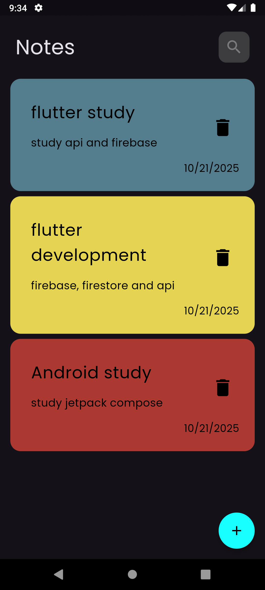
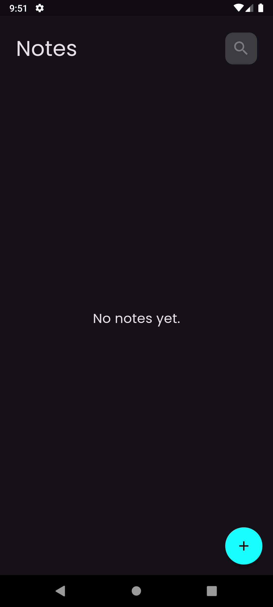
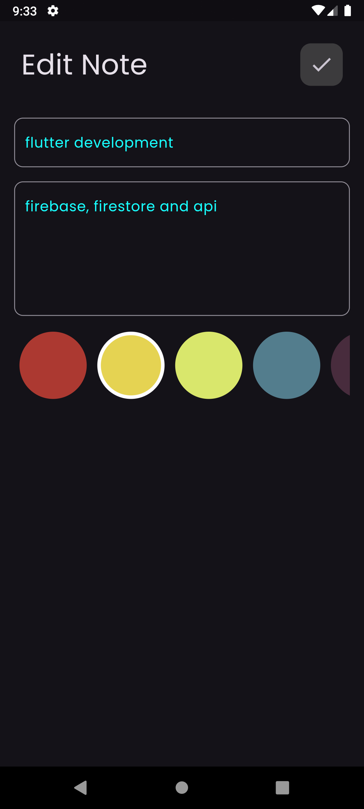

# Notes App 📝

A beautiful and simple notes application built with Flutter that allows users to create, edit, and delete notes with customizable colors.

## Features ✨

- **Create Notes**: Add new notes with title and content
- **Edit Notes**: Modify existing notes anytime
- **Delete Notes**: Remove notes you no longer need
- **Color Customization**: Choose from 5 different colors for each note
- **Persistent Storage**: All notes are saved locally using Hive database
- **Clean UI**: Modern and intuitive user interface with dark theme
- **State Management**: Efficient state management using Flutter BLoC

## Screenshots 📱

## Home Screen

<p align="center">
      
  
  

</p>

---

## Edit notes Screen
<p align="center">
  
</p>

---

## Technologies Used 🛠️

- **Flutter**: Cross-platform mobile development framework
- **Dart**: Programming language
- **Hive**: Fast, lightweight NoSQL database for local storage
- **Flutter BLoC**: State management solution
- **Intl**: Date formatting

## Dependencies 📦

```yaml
dependencies:
  flutter_bloc: ^9.1.1
  hive: ^2.2.3
  hive_flutter: ^1.1.0
  intl: ^0.20.2
  
dev_dependencies:
  build_runner: ^2.5.4
  hive_generator: ^2.0.1
```

## Getting Started 🚀

### Prerequisites

- Flutter SDK (3.7.2 or higher)
- Dart SDK
- Android Studio / VS Code
- An emulator or physical device

### Installation

1. Clone the repository
```bash
git clone https://github.com/mohamed-oraby10/notes_app.git
```

2. Navigate to the project directory
```bash
cd notes_app
```

3. Install dependencies
```bash
flutter pub get
```

4. Generate Hive adapter files
```bash
flutter pub run build_runner build
```

5. Run the app
```bash
flutter run
```

## Project Structure 📁

```
lib/
├── cubits/
│   ├── add_note_cubit/
│   │   ├── add_note_cubit.dart
│   │   └── add_note_state.dart
│   └── notes_cubit/
│       ├── notes_cubit.dart
│       └── notes_state.dart
├── models/
│   ├── note_model.dart
│   └── note_model.g.dart
├── views/
│   ├── notes_view.dart
│   └── edit_notes_view.dart
├── widgets/
│   ├── add_note_form.dart
│   ├── add_note_sheet.dart
│   ├── add_text_field.dart
│   ├── colors_list_view.dart
│   ├── custom_app_bar.dart
│   ├── edit_note_body.dart
│   ├── edit_note_colors_list.dart
│   ├── notes_app_body.dart
│   ├── note_item.dart
│   └── sheet_button.dart
├── constants.dart
├── simple_bloc_observer.dart
└── main.dart
```

## Architecture 🏗️

This app follows the **BLoC (Business Logic Component)** pattern for state management:

- **Cubits**: Handle business logic and state management
  - `AddNoteCubit`: Manages the state of adding new notes
  - `NotesCubit`: Manages the state of fetching and displaying notes
  
- **Models**: Data structures
  - `NoteModel`: Represents a note with title, subtitle, date, and color
  
- **Views**: Screen-level widgets
  - `NotesView`: Main screen displaying all notes
  - `EditNotesView`: Screen for editing existing notes
  
- **Widgets**: Reusable UI components

## How It Works 🔄

1. **Adding a Note**:
   - Tap the floating action button
   - Fill in title and content
   - Select a color
   - Tap "Add" button
   - Note is saved to Hive database

2. **Editing a Note**:
   - Tap on any note
   - Modify title or content
   - Change color if desired
   - Tap check icon to save changes

3. **Deleting a Note**:
   - Tap the delete icon on any note
   - Note is immediately removed from storage

## Color Palette 🎨

The app includes 5 predefined colors:
- Red: `#AC3931`
- Yellow: `#E5D352`
- Green: `#D9E76C`
- Blue: `#537D8D`
- Purple: `#482C3D`

## Contributing 🤝

Contributions are welcome! Please feel free to submit a Pull Request.

1. Fork the project
2. Create your feature branch (`git checkout -b feature/AmazingFeature`)
3. Commit your changes (`git commit -m 'Add some AmazingFeature'`)
4. Push to the branch (`git push origin feature/AmazingFeature`)
5. Open a Pull Request

## Contact 📧

Mohamed Oraby - [@mohamed-oraby10](https://github.com/mohamed-oraby10)

## Acknowledgments 🙏

- Flutter team for the amazing framework
- Hive team for the efficient local database
- Flutter BLoC team for the state management solution

---

Made with ❤️ using Flutter
